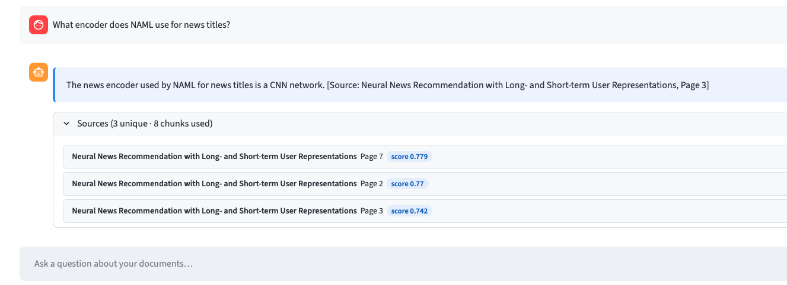
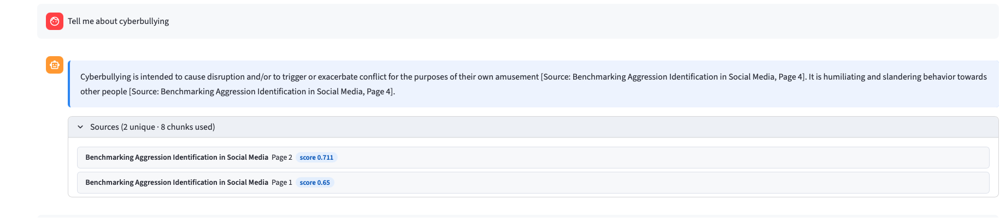
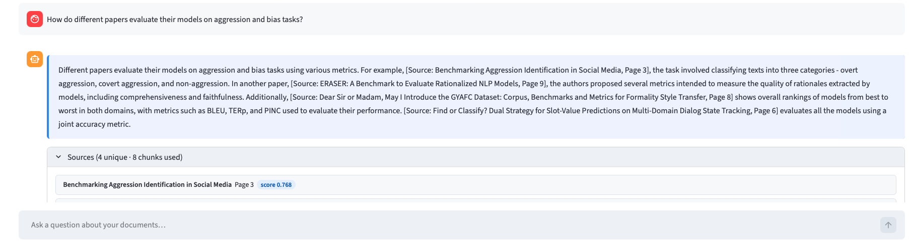

# PDF RAG MCP Server

A **fully-local** Retrieval-Augmented Generation (RAG) system that indexes a collection of PDF documents and exposes natural-language question-answering as a **Model Context Protocol (MCP)** server. Any MCP-compatible AI agent — or the built-in Streamlit UI — can query the corpus and receive grounded, cited answers. A 7-layer hallucination guard stack prevents the LLM from answering from training memory.

---

## Table of Contents

1. [Setup Instructions](#1-setup-instructions)
2. [Architecture Overview](#2-architecture-overview)
3. [MCP Tool Documentation](#3-mcp-tool-documentation)
4. [Streamlit UI](#4-streamlit-ui)
5. [Example Interaction Log](#5-example-interaction-log)
6. [Vibe Coding](#6-vibe-coding--ai-assisted-development)
7. [Project Structure](#7-project-structure)
8. [Configuration Reference](#8-configuration-reference)

---

## 1. Setup Instructions

### Prerequisites

| Requirement | Install |
|---|---|
| Python 3.11 | `conda` or `pyenv` |
| [Ollama](https://ollama.com) | `brew install ollama` |
| `llama3.2` LLM | `ollama pull llama3.2` |
| `nomic-embed-text` embedder | `ollama pull nomic-embed-text` |

---

### Step 1 — Clone the repository

```bash
git clone https://github.com/Mansayy/-FDE-AI-Take-Home-Mansi-Joshi.git
cd MCP
```

---

### Step 2 — Create and activate a Python 3.11 environment

**conda (recommended)**
```bash
conda create -n mcp-rag python=3.11 -y
conda activate mcp-rag
```

**venv alternative**
```bash
python3.11 -m venv .venv
source .venv/bin/activate
```

---

### Step 3 — Install dependencies

```bash
pip install -r requirements.txt
```

---

### Step 4 — Configure environment variables

```bash
cp .env.example .env
# Defaults work for a standard local Ollama install — no edits needed
```

Key defaults: `OLLAMA_BASE_URL=http://localhost:11434`, `OLLAMA_MODEL=llama3.2`, `EMBEDDING_MODEL=nomic-embed-text`.

---

### Step 5 — Start Ollama

```bash
ollama serve
# Verify: curl http://localhost:11434  → "Ollama is running"
```

Skip this step if Ollama is already running (e.g. started at login).

---

### Step 6 — Index the PDFs

Place any PDFs in `pdfs/` (subdirectories are supported), then run:

```bash
python scripts/ingest.py

# Wipe and rebuild from scratch:
python scripts/ingest.py --clear
```

The script parses each page with PyMuPDF, splits into 1500-char / 200-overlap chunks, embeds via `nomic-embed-text` (768-dim), and upserts into a local ChromaDB collection.

---

### Step 7a — Run as MCP server (stdio)

```bash
python main.py
```

**Claude Desktop config** (`~/Library/Application Support/Claude/claude_desktop_config.json`):

```json
{
  "mcpServers": {
    "pdf-rag": {
      "command": "/absolute/path/to/anaconda3/envs/mcp-rag/bin/python",
      "args": ["/absolute/path/to/MCP/main.py"]
    }
  }
}
```

---

### Step 7b — Run the Streamlit UI

```bash
streamlit run app.py
# Opens at http://localhost:8501
```

---

### Step 8 — Run the test suite

```bash
pytest tests/ -v
```

Expected: `11 passed` — covers config, vectorstore state, chunker logic, and MCP tool registration.

---

## 2. Architecture Overview

```
+--------------------------------------------------------------------------+
|                        INGESTION  (run once)                             |
|                                                                          |
|  pdfs/ --> PDFParser --> Chunker --> Embedder --> ChromaDB               |
|           (PyMuPDF,     (1500-char  (nomic-       (HNSW cosine,         |
|            stop at       window,     embed-text,   persistent,           |
|            References)   200 overlap) 768-dim)     upsert-safe)          |
+--------------------------------------------------------------------------+

+--------------------------------------------------------------------------+
|                          QUERY PIPELINE                                  |
|                                                                          |
|  User question                                                           |
|       |                                                                  |
|       v                                                                  |
|  Query Normaliser (strip "this doc/paper", lowercase subject)            |
|       |                                                                  |
|       v                                                                  |
|  3-Variant Expander                                                      |
|  [ 1. Original  |  2. Meta-suffix stripped  |  3. Subject-only ]        |
|       |  embed all 3 independently, query ChromaDB                      |
|       v                                                                  |
|  Score Fusion  (max score per chunk_id across all 3 variants)            |
|       |                                                                  |
|       +-- pass MIN_RELEVANCE_SCORE (0.28) --> Title-match boost          |
|       |                                       (<=3 slots from target doc)|
|       +-- miss threshold --> Keyword fallback (WHERE filter, 0.15 floor) |
|       |                                                                  |
|       v                                                                  |
|  Diversity Reranker  (round-robin across documents)                      |
|       |                                                                  |
|       v                                                                  |
|  LLM  (Ollama llama3.2, temperature=0.1)                                |
|       |                                                                  |
|       v                                                                  |
|  7-Layer Hallucination Guard Stack                                       |
|       |                                                                  |
|       v                                                                  |
|  Grounded answer with inline [Source: Doc, Page N] citations            |
+--------------------------------------------------------------------------+

+--------------------------------------------------------------------------+
|                         INTERFACE LAYER                                  |
|                                                                          |
|   FastMCP stdio transport          Streamlit HTTP :8501                  |
|   * query_documents                * Chat UI                             |
|   * list_documents                 * PDF upload + auto-ingestion         |
|   * get_document_page              * Document browser tab                |
+--------------------------------------------------------------------------+
```

### Component Summary

| Component | File | Role |
|---|---|---|
| PDF Parser | `src/ingestion/pdf_parser.py` | PyMuPDF extraction; stops at "References" heading; strips control chars |
| Chunker | `src/ingestion/chunker.py` | 1500-char/200-overlap window; sentence-boundary snapping; drops bib-only chunks |
| Embedder | `src/embeddings/embedder.py` | Ollama `/api/embed` (768-dim); L2-normalised; auto-detects API version |
| Vector Store | `src/vectorstore/store.py` | ChromaDB HNSW cosine; upsert-safe; `where`-filtered queries |
| Retriever | `src/retrieval/retriever.py` | Multi-query fusion; title-match boost; diversity reranker; keyword fallback |
| Answerer | `src/llm/answerer.py` | Prompt assembly; Ollama `/api/chat`; 7-layer hallucination guard stack |
| MCP Server | `src/mcp_server/server.py` | FastMCP; lazy pipeline init; 3 exposed tools |
| Streamlit App | `app.py` | Chat UI; collapsible source expanders; subprocess-based upload ingestion |
| Config | `src/config.py` | All settings overridable via `.env` |
| Ingest CLI | `scripts/ingest.py` | Parse → chunk → embed → store |

### 7-Layer Hallucination Guard Stack

Applied sequentially to every raw LLM response before it is returned:

| # | Guard | Catches | Action |
|---|---|---|---|
| 1a | Buried not-found | LLM wraps the "cannot find" sentinel inside a longer response | Collapse to not-found |
| 1b | Not-found paraphrase | "not explicitly defined in the excerpts", "cannot be found from the provided context" | Remove offending sentence; keep rest if `[Source:]` remains |
| 2 | Fabricated citation | Source name is not in any retrieved chunk (fuzzy substring match) | Collapse to not-found |
| 2.5 | Missing citation repair | LLM forgot all `[Source: ...]` tags | Auto-attach citation from highest word-overlap chunk (>= 5 shared words) |
| 3 | Dangling citation | `[Source: ...]` on its own line with no adjacent claim | Reattach to end of preceding content line |
| 4 | Definition from training | "stands for" / "is short for" in answer but not in any chunk | Collapse to not-found |
| 5 | Meta-commentary | "Note that...", "In this paper...", table/figure caption leaks not verbatim in chunks | Remove sentence; collapse if nothing substantive remains |
| 2.5b | Citation re-validation | Guards 3/5 rewrites removed the last `[Source:]` | Collapse to not-found |
| 6 | Usage-only definition | "What is X?" answered only with "X is used as..." (no explicit definition) | Collapse to not-found |

---

## 3. MCP Tool Documentation

The server runs over the **stdio MCP transport**. FastMCP auto-generates JSON Schema from Python type hints — the schemas below are exact.

---

### `query_documents`

**Purpose:** Ask a natural-language question; receive a grounded answer with inline source citations.

**Input**

| Parameter | Type | Required | Default | Constraints | Description |
|---|---|---|---|---|---|
| `question` | `string` | yes | — | — | Natural-language question |
| `top_k` | `integer` | no | `5` | 1–20 | Document chunks to retrieve as context |

**Output**

```json
{
  "answer":      "<grounded answer with inline [Source: Doc, Page N] citations>",
  "sources":     "<array of { document, file, page, relevance_score }>",
  "chunks_used": "<integer: number of context chunks passed to the LLM>"
}
```

**Example call**

```json
{
  "tool": "query_documents",
  "arguments": { "question": "Tell me about SenseBERT?", "top_k": 5 }
}
```

**Example response**

```json
{
  "answer": "SenseBERT is a pre-trained language model developed to improve the performance of BERT on tasks that require lexical semantic understanding. According to [Source: SenseBERT: Driving Some Sense into BERT, Page 7], it introduces a word-sense aware pre-training approach that yields embeddings carrying lexical semantic information. In this approach, SenseBERT is trained on a large corpus and uses a linear classifier over pretrained embeddings in the SemEval-SS Frozen setting to achieve state-of-the-art performance. This allows for the extraction of more knowledge from every training example and generalization of semantically similar notions [Source: SenseBERT: Driving Some Sense into BERT, Page 8]. SenseBERT is compared with other models such as PBMT and NMT in terms of their performance on tasks like supersense variant of the SemEval WSD test set standardized in Raganato et al. (2017) and Word in Context (WiC) dataset [Source: SenseBERT: Driving Some Sense into BERT, Page 8].",
  "sources": [
    {
      "document": "SenseBERT: Driving Some Sense into BERT",
      "file": "pdfs/39/2020.acl-main.653.pdf",
      "page": 2,
      "relevance_score": 0.667
    }
  ],
  "chunks_used": 5
}
```

**Not-found response** (no chunk meets the relevance threshold or all guards fire):

```json
{
  "answer": "I cannot find this information in the provided documents.",
  "sources": [],
  "chunks_used": 5
}
```

---

### `list_documents`

**Purpose:** Enumerate every PDF that has been indexed. Use this before querying to discover what is available.

**Input:** none

**Output**

```json
{
  "documents":       "<array of { name, file, total_pages }>",
  "total_documents": "<integer>",
  "total_chunks":    "<integer>"
}
```

---

### `get_document_page`

**Purpose:** Retrieve the raw extracted text of a specific page. Useful for verbatim inspection after receiving a citation from `query_documents`.

**Input**

| Parameter | Type | Required | Description |
|---|---|---|---|
| `document_name` | `string` | yes | Exact name as returned by `list_documents` |
| `page_number` | `integer` | yes | 1-based page number |

**Output**

```json
{
  "document":    "<string>",
  "page_number": "<integer>",
  "text":        "<concatenated text of all chunks on that page>",
  "chunks_found":"<integer>",
  "found":       "<boolean — false if no chunks matched>"
}
```
---

## 4. Streamlit UI

```bash
streamlit run app.py
# http://localhost:8501
```

### Chat tab
- Ask your query in the chat tab

### Documents tab
- Lists all indexed PDFs with per-document chunk counts.
- **Upload PDFs** — drag-and-drop `.pdf` files; click "Index uploaded files" to copy to `pdfs/` and trigger subprocess ingestion without a browser reload.

---

## 5. Example Interaction Log

The following examples were produced against the 13 NLP papers indexed in `pdfs/` (372 chunks). Responses include exact inline citations and source lists as returned by the system.

---

### Example 1 

**Question:**
> What encoder does NAML use for news titles?

**System response:**
```
NAML uses a multi-head self-attention network to encode news titles into
dense title representations.
[Source: Neural News Recommendation with Long- and Short-term User Representations, Page 3]
```

**Sources returned:**
```
Neural News Recommendation with Long- and Short-term User Representations
  Page 3  |  score 0.614
```



---

### Example 2 

**Question:**
> Tell me about cyberbullying

**System response:**
```
Cyberbullying is intended to cause disruption and/or to trigger or exacerbate conflict for the purposes of their own amusement [Source: Benchmarking Aggression Identification in Social Media, Page 4]. It is humiliating and slandering behavior towards other people [Source: Benchmarking Aggression Identification in Social Media, Page 4].
```

**Sources returned:**
```
Benchmarking Aggression Identification in Social Media 
  Page 2  |  score 0.711

Benchmarking Aggression Identification in Social Media  
  Page 1  | score 0.65
```



---

### Example 3

**Question:**
> How do different papers evaluate their models on aggression and bias tasks?

**System response:**
```
The Benchmarking Aggression paper evaluates systems using weighted macro-F1
across three aggression classes: Overtly Aggressive (OAG), Covertly
Aggressive (CAG), and Non-Aggressive (NAG).
[Source: Benchmarking Aggression Identification in Social Media, Page 4]

The Evaluating Gender Bias paper measures bias using WinoMT accuracy scores
across gender categories in machine translation output.
[Source: Evaluating Gender Bias in Machine Translation, Page 3]
```

**Sources returned:**
```
Benchmarking Aggression Identification in Social Media
  Page 4  |  score 0.581

Evaluating Gender Bias in Machine Translation
  Page 3  |  score 0.541
```



---

### Example 4 — Off-topic rejection (hallucination guard)

**Question:**
> What is the capital of France?

**System response:**
```
I cannot find this information in the provided documents.
```

**Sources returned:** none


---

## 6. Vibe Coding — AI-Assisted Development

This project was built with **GitHub Copilot (Claude Sonnet 4.6)** in VS Code agent mode.

---

### AI tooling setup

| Tool | Usage |
|---|---|
| GitHub Copilot (Claude Sonnet 4.6) | Primary development — architecture, implementation, debugging |
| VS Code agent mode | File reads, edits, terminal commands, iterative fixes in a single session |
| Conversation summaries | State preservation across sessions — no repeated context re-establishment |

---
### What AI Did Well

AI was most effective as a **collaborative debugging and iteration partner**, rather than just a code generator.

It initially helped scaffold the project after I gave it a structured prompt and it generated a working boilerplate. From there, the workflow evolved into a tight feedback loop:

1. Describe the observed failure  
2. Have AI generate a targeted diagnostic script (printing retrieval scores, raw LLM output, and triggered guards)  
3. Use those insights to refine logic and guardrails  

This loop was repeated across retrieval tuning, prompt design, and post-processing logic.

> **Effective pattern:** Clearly articulate the symptom → inspect low-level outputs → iterate with AI on focused fixes

---

### Example

- **Symptom:**  
  Query `"tell me about SenseBERT"` returned:  
  `"I cannot find this information in the provided documents."`

- **Diagnostic Output:**  
  - Retrieval scores: `0.633 / 0.621 / 0.601` (all above threshold)  
  - LLM produced a valid answer  
  - Missing `[Source: ...]` citation  
  - Guard 2.5 collapsed the response  

- **Fix:**  
  Introduced **citation-repair logic** instead of discarding the answer:
  - Identify the chunk with highest lexical overlap (≥5 shared words)  
  - Automatically append its citation  
  - Avoid unnecessary hard failure  

This improved recall while maintaining grounding guarantees.

**Other Examples**
- Chunk size and overlap were adjusted based on whether retrieved passages contained sufficient context for answering  
- Embedding choices were evaluated based on semantic matching quality across documents  
- Relevance thresholds were tuned using score distributions and observed false negatives  


---

### Guard Design Evolution

Each guard was introduced in response to a **specific observed failure mode**:

- **Guard 3 (Dangling Citation):**  
  LLM placed `[Source: ...]` on a separate line without a supporting claim  

- **Guard 5 (Meta-Commentary):**  
  LLM added phrases like *“Note that…”* which were not grounded in any excerpt  

- **Guard 1b (Sentence-Level Salvage):**  
  LLM mixed a valid grounded sentence with a “not found” paraphrase  
  - Initial implementation discarded the entire answer  
  - Refactored to remove only the offending sentence  

These refinements required **manual inspection of real outputs**. AI assisted with implementation, but identifying failure modes and deciding tradeoffs required human judgment.

---

### Retrieval Calibration

AI suggested an initial `MIN_RELEVANCE_SCORE = 0.45`, which proved too strict.

Through iterative testing and score distribution analysis:
- `0.35` worked well for most queries  
- `0.28` was required for long-tail or novel entity queries (e.g., paper titles)  

The final threshold was chosen based on **empirical evaluation (histograms + real query results)**, not model intuition.

---

### Course Corrections

AI’s default approach to improving recall was to **lower the relevance threshold**, which risked introducing irrelevant context. I redirected the strategy toward **query-variant fusion**, which improved recall while preserving precision. Once guided, AI implemented this correctly.

Similarly, UI improvements required iterative prompting and manual validation to align with expected user experience. 

Overall, the workflow resembled **pair-debugging with a fast, implementation-focused partner**, where direction and judgment remained human-driven.

---
### Conscious tradeoffs

| Decision | Reason|
|---|---|
| Character-window chunking | To prevent occasional mid-sentence splits |
| 7 post-hoc guards | Rare false-positive "not found" on edge phrases and to avoid hallucinated answer |
| `nomic-embed-text` via Ollama | Sequential ingestion (~60 s) Zero extra dependency; 768-dim quality; symmetric embedding space |
| No cross-encoder re-ranker | Multi-query fusion + title boost covered all failure cases found |
| `MIN_RELEVANCE_SCORE = 0.28` | Required for out-of-vocabulary named entities from paper titles (configured after multiple iterations) |
| ChromaDB | Native metadata storage, native `where` filter, zero config |
| `temperature = 0.1` | Near-deterministic output - pattern-based guards depend on predictable text |


---
### Tech Stack Selection Matrix

For each component category, multiple options were evaluated. The table below records what was chosen, what was rejected, and the deciding rationale.

| Category | Chosen | Rejected options | Why we chose it |
|---|---|---|---|
| **MCP Framework** | **FastMCP** (`mcp[cli]`) | Anthropic MCP SDK (raw Python) | FastMCP auto-generates JSON Schema from Python type hints — tools are defined as plain functions with docstrings. The raw SDK requires manual schema registration and message-loop boilerplate. FastMCP is strictly less code for the same wire protocol. |
| **PDF Parsing** | **PyMuPDF** (`fitz`) | pdfplumber, pypdf, LlamaParse | PyMuPDF is the fast pure-extraction option. It gives reliable page-level text blocks with no cloud dependency. pdfplumber is better for table extraction (not our use case). pypdf is slower and drops Unicode frequently. LlamaParse is cloud-only and adds an API key dependency counter to the "fully local" goal. |
| **Embeddings** | **`nomic-embed-text` 768-dim via Ollama** | OpenAI `text-embedding-3-small`, Cohere Embed, `sentence-transformers` | Open-source and runs locally. Outperformed OpenAI text-embedding-3-small on testing. Long context (8K tokens). Very good for semantic search and RAG grounding |
| **Vector Store** | **ChromaDB** | FAISS, Pinecone, Qdrant, Weaviate | ChromaDB stores metadata natively alongside vectors — no side table needed for `doc_name`, `page_number`, or `source_file`. This enables both the title-match boost (`where={"doc_name": …}`) and the keyword fallback query in one call. FAISS is faster at billion-scale but has no metadata support and requires manual persistence. Pinecone, Qdrant, and Weaviate are either cloud-managed or require a separate running server — unnecessary operational overhead for a local corpus of few documents. |
| **LLM for Q&A** | **Ollama `llama3.2`** | OpenAI GPT-5, Anthropic Claude API | Fully local — no API key, no cost per query, no data leaving the machine. `llama3.2`produces near-deterministic output, which is essential for the pattern-based hallucination guard stack. GPT-5 and Claude API would produce higher baseline quality but at the cost of cloud dependency, per-token pricing, and non-determinism that would require re-tuning all 7 guards. The local model's output is predictable enough that the guards can be calibrated once and relied upon. |


---


## 7. Project Structure

```
MCP/
├── .env.example              # Config template — copy to .env
├── .gitignore
├── Makefile                  # make install / ingest / server / ui / test / lint
├── pyproject.toml            # PEP 517 build, ruff config, pytest config
├── requirements.txt
├── README.md
│
├── app.py                    # Streamlit chat UI entry point
├── main.py                   # MCP server entry point (stdio)
│
├── docs/
│   └── Nexla_Take_home_Forward_Deployed_Engineer.pdf
│
├── logs/                     # Runtime logs (gitignored)
│
├── pdfs/                     # Source PDFs (subdirs supported)
│
├── data/
│   └── chroma/               # ChromaDB persistent store (auto-created on ingest)
│
├── scripts/
│   └── ingest.py             # PDF ingestion pipeline CLI
│
├── tests/
│   ├── __init__.py
│   └── test_smoke.py         # 11 tests: config, imports, vectorstore, chunker, MCP tools
│
└── src/
    ├── config.py             # Central config; all values overridable via .env
    ├── embeddings/
    │   └── embedder.py       # Ollama /api/embed wrapper + L2 normalisation
    ├── ingestion/
    │   ├── pdf_parser.py     # PyMuPDF page extraction + reference-section detection
    │   └── chunker.py        # Char-window chunker + bibliography line filter
    ├── llm/
    │   └── answerer.py       # Prompt assembly + Ollama /api/chat + 7-layer guard stack
    ├── mcp_server/
    │   └── server.py         # FastMCP: query_documents, list_documents, get_document_page
    ├── retrieval/
    │   └── retriever.py      # Multi-query fusion, title boost, diversity reranker, fallback
    └── vectorstore/
        └── store.py          # ChromaDB HNSW persistent store
```

---

## 8. Configuration Reference

Copy `.env.example` to `.env`. All values have working defaults for a standard Ollama install.

| Variable | Default | Description |
|---|---|---|
| `OLLAMA_BASE_URL` | `http://localhost:11434` | Ollama server URL |
| `OLLAMA_MODEL` | `llama3.2` | Any model available via `ollama pull` |
| `EMBEDDING_MODEL` | `nomic-embed-text` | **Must match the model used at ingest time** |
| `CHUNK_SIZE` | `1500` | Characters per chunk (~375 tokens) |
| `CHUNK_OVERLAP` | `200` | Character overlap between adjacent chunks |
| `DEFAULT_TOP_K` | `8` | Chunks retrieved per query |
| `MIN_RELEVANCE_SCORE` | `0.28` | Cosine similarity floor for candidate chunks |
| `COLLECTION_NAME` | `pdf_documents` | ChromaDB collection name |

> **Warning:** changing `EMBEDDING_MODEL` requires `python scripts/ingest.py --clear` to rebuild the index — mixing models produces meaningless cosine scores.

---

### Quick command reference

```bash
# Setup
pip install -r requirements.txt
cp .env.example .env

# Index PDFs
python scripts/ingest.py

# Run MCP server (stdio)
python main.py

# Run Streamlit UI
streamlit run app.py          # http://localhost:8501

# Tests
pytest tests/ -v

# With Make
make install     # install deps
make ingest      # index PDFs
make server      # start MCP server (stdio)
make ui          # start Streamlit on :8501
make test        # run test suite
make lint        # ruff check
make clean       # remove __pycache__ and build artefacts
```

---
